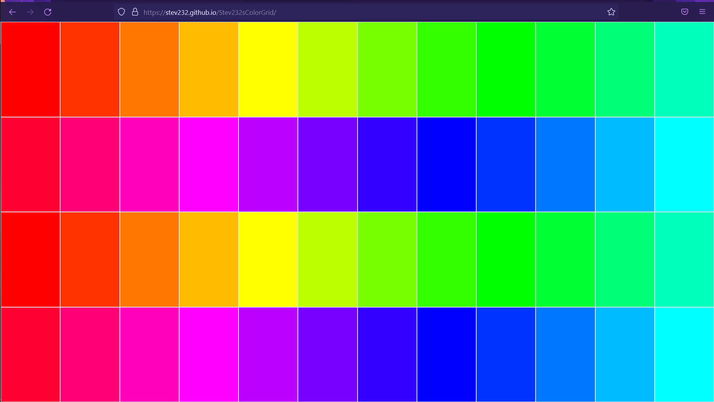

# Stev232sColorGrid

## Description

This program will generate rectangles across a webpage. These rectangles will appear as a different color when hovered over. If the rectangle is click on then the color is cleared from the rectangle.  

Latest update brings in jQuery to help reduce the size of scripts.js. In this project I will be utilizing jQuery to look for on click events and on hover events. For click events I will be using .on('click', function(event)) line. For on hover events I will be using .hover(function(event)) line.

## ScreenShot

## Deployment Link

Link: https://stev232.github.io/Stev232sColorGrid/